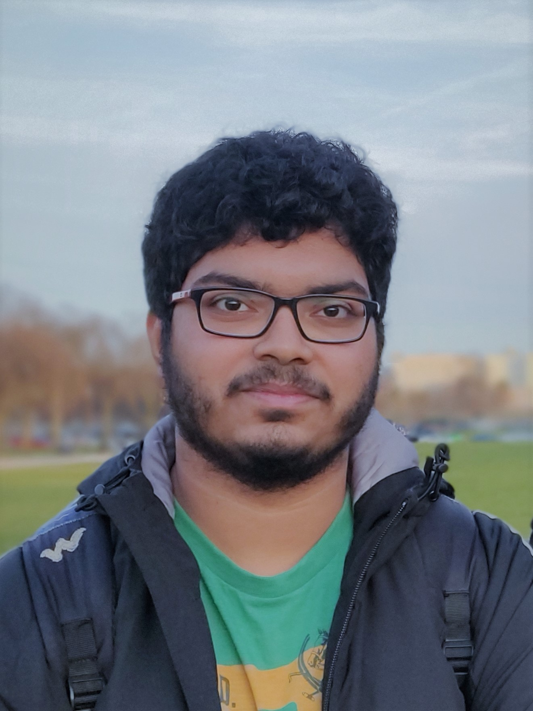

# Hi there!

!!! important "Internship"
    I'm excited to share that I'll be joining the PSG group at [Intel](https://www.intel.com/content/www/us/en/products/programmable.html) in the Summer of 2021 for an internship!

I'm a PhD Student in the Electrical and Computer Engineering Department at Carnegie Mellon University, Pittsburgh since August 2019. I am advised by [Prof. James Hoe](http://users.ece.cmu.edu/~jhoe/doku/doku.php) and my research is geared towards reconfigurable computing at datacenter scale. I'm part of the multi-university research team at the [Crossroads FPGA Center](https://www.crossroadsfpga.org) which is funded by [Intel](https://www.intel.com) and [VMware](https://www.vmware.com). I'm also affiliated with the Computer Architecture Lab at Carnegie Mellon ([CALCM](https://research.ece.cmu.edu/~calcm/doku.php)).

I completed my Bachelor's and Master's degree from the [Indian Institute of Technology, Bombay](https://www.iitb.ac.in), in [Electrical Engineering](https://www.ee.iitb.ac.in). My Master's [thesis](DDP_Final_Dissertation_OneSide.pdf) titled "Accelerated Circuit Simulation: Harmonic Balance and Logic Partitioning" was under the guidance of [Prof. Sachin Patkar](https://www.ee.iitb.ac.in/wiki/faculty/patkar).

Find a little bit more about me [here](about/bio.md). A more elaborate account of my technical work can be found in [my resume](about/resume.md).

You can get to me at shashankov@cmu.edu. All other social links are available at the bottom on the page.
[comment]: <> (<iframe src="https://docs.google.com/forms/d/e/1FAIpQLSejz0ZczklGHAM3d-lWdamebIM4koCKKoBBaSkDG6jaQeqLLw/viewform&embedded=true" width="700" height="520" frameborder="0" marginheight="0" marginwidth="0">Loading...</iframe>)
[comment]: <> (

)

*[PSG]: Programmable Solutions Group
