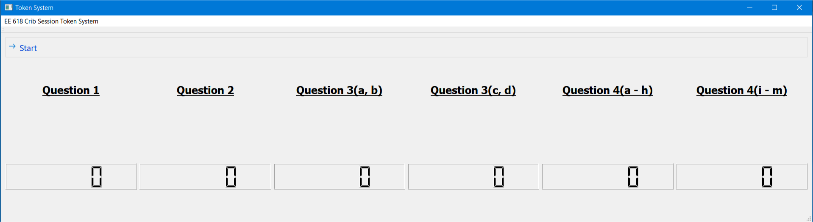

# Token System

## Description

The token system implements a queue based allocation system for handling customers with requests in a [FCFS](https://en.wikipedia.org/wiki/Scheduling_(computing)#First_come,_first_served) (First Come, First Served) manner. The motivation behind this code was to streamline the Answer Sheet Grading doubt session or, as it is called here in IIT Bombay, the `"Crib Session"`, for the course in which I am a Teaching Assistant.

## Dependencies

### Google Forms 

The project, to facilitate ease of access on the clients' (Students) and the servers' (Teaching Assistants), uses [Google Forms](https://docs.google.com/forms/u/0/) to supply the input data stream. To use Google Forms, the user of the code must have access to Google Forms and hence also must have a [Google Account](https://account.google.com/).

### Operating System

The project has been written in [Python3](https://www.python.org/) and compiled into a standalone executable using [PyInstaller 3.4](https://pyinstaller.readthedocs.io/en/stable/) and tested on two systems:

* Ubuntu 18.04.1
* Windows 10

!!! note
    For Linux based systems, the python executable depends on linking of some libraries which may require latest packages available on the said systems. The [source code](source.md) is available for those who would like to use or build the program from source.

Also for Ubuntu systems, updates can be performed as:

``` bash
sudo apt update
sudo apt upgrade
```

## Setup

The program along with the `credentials.json` file which is required to connect to the Google Sheets API and a sample configuration file can be found in release hosted on Github:

> [Release Version 1.0](https://github.com/ShashankOV/Token-System/releases/tag/v1.0)

The `tar.gz` version is for Linux while `.zip` for Windows.

!!! info
    The first time you run the program, you'll have to login to your Google ID to provide the program access to read your Google Sheets
!!! warning
    Note that the archives don't have a sub-folder and hence extracting releases all the contents into the current directory.

### Linux

First extract the downloaded release:

``` bash
mkdir token
tar -xzvf <PATH_TO_DOWNLOAD_LOCATION>/token_v1.0.tar.gz -C token
cd token
```

Then the executable must be given execute permissions and can be run as follows:

``` bash
chmod +x generic
./generic
```

### Windows

Extract the ZIP archive into a folder and run `generic.exe`

## Setting up Google Forms

To setup the Google Forms and Google Sheets environment to work with the program go to the [Google Forms](forms.md) page.

## Configuration 

For easy configurability without having to edit any code, the project supports a configuration file. Detailed description of the components of the file can be found [here](configuration.md)

## Graphical User Interface

The GUI is used to display the allocation to everyone (even the servers) as this is the only output (other than the debug output on the terminal).

The GUI supports upto 12 queues in the form of 2 rows with 6 queues in each. The above image shows a sample with 6 such queues.

|Sr. No.| Brief Info  | Long Description                                  |
|-------|-------------|---------------------------------------------------|
|Row 1  | Headers     | Queue names obtained from the configuration file  |
|Row 2  | ID          | Students' Unique Roll Number/ID                   |
|Row 3  | Name        | Students' Name or anything other parameter        |
|Row 4  | Queue Size  | Number of waiting requests                        |
